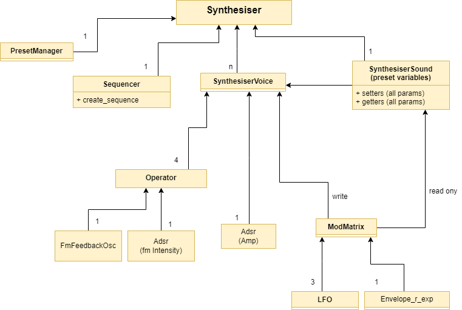

The project structure is organized into three main directories, each serving a specific role in the application architecture:

1. **`static/`**: Houses the **Frontend** assets (web page, styles), interaction logic, and database configuration.
2. **`routes/`**: Manages the communication channels (API endpoints) between the frontend and the backend.
3. **`synth/`**: Contains the core **Audio Engine** logic.

# Directories & Main Files

### `server.py`
This file serves as the **main entry point** for the application.
Upon execution, it performs three critical tasks:
1. **Instantiation:** It creates the global instance of the Synthesizer engine (Backend).
2. **Integration:** It initializes the Flask application and registers the necessary API routes, establishing the communication bridge between the JavaScript frontend and the Python backend.
3. **Serving:** It renders and serves the `index.html` page, delivering the user interface to the client.

> # STATIC (Web Page & interaction)
### `index.html`
This file serves the main web page linked to server.py. The layout is divided into distinct sections, each representing a fundamental component of the synthesizer.

* UI Components: The knobs and sliders are provided by the webaudio-controls library. These are used to modify parameters on the user side.
* Event Handling: User interactions (setter calls) on these controls are captured and forwarded to the `update_parameters.js` script.

**Preset Loading Logic**: At the bottom of the file, there is a JavaScript block containing the `setValueAndChange()` function. This function is crucial for the database preset loading system.
* The Challenge: While every backend parameter has a corresponding setter, the UI knobs do not automatically read (poll) values from the backend in real-time.

* The Solution: When a preset is loaded, `setValueAndChange()` explicitly maps and pushes every stored value to its corresponding UI element to ensure the visual interface matches the audio engine state.

### `update_parameters.js`
This file defines the specific functions triggered whenever a synth parameter is modified by the user.

* **Functionality**: Generally, these functions require two arguments: the parameter name and the target value.
* **Routing**: The requests are forwarded to `routes/api_routes.py`, which handles the actual state update in the Python backend.

### `sequencer.js`
This file manages the generation, logic, and interactivity of the sequencer user interface.
* **Specs:** The sequencer features 64 steps with a maximum polyphony of 6 notes per step.
* **Timing:** All steps share a uniform duration stored in the `step_len` variable. This is dynamically calculated based on the current `bpm` (Beats Per Minute) and `note_type` (quantization: 1/4, 1/8, 1/16, etc.).
* **View Control:** The `baseOctave` variable determines which octave range is currently visible.
* **Data Structure:** The musical sequence is stored in `sequencer_status`, structured as an array of arrays (where the outer array represents steps and inner arrays contain the active notes).

**Key Interactions:**
* **Transport:** The **Spacebar** toggles the Play/Pause state.
* **Navigation:** The **mouse wheel** controls horizontal scrolling, allowing seamless access to all 64 steps.
* **Editing Tools:** Dedicated **"Transpose All"** buttons are provided to shift the pitch of the entire sequence globally for better accessibility.
* **Persistence:** Sequences support full CRUD operations: they can be loaded, saved, and overwritten in the database.
* **Export:** The **"Export WAV"** button triggers the rendering process and allows the user to download the final audio file.

### `play_sound.js`
This script serves as the bridge between the frontend sequencer and the backend audio engine.
* **Functionality:** It initiates the HTTP request to the Python backend to trigger sound generation.
* **Data Flow:** It retrieves critical variables from `sequencer.js` (specifically `sequencer_status` and `step_len`) and forwards them to the `routes/audio_routes.py` endpoint.
* **Cache Busting:** The current timestamp is appended to the request payload. This ensures that the server processes the most up-to-date data rather than serving a cached response.

### Visual Feedback Scripts

* **`algo_images.js` & `draw_adsr.js`**
These two scripts operate in tandem to provide immediate visual feedback whenever the **Algorithm** parameter (`id="algorithm"`) is modified.

* **`algo_images.js`**: It dynamically swaps the displayed diagram (PNG) to match the current FM routing topology (Operator configuration).
* **`draw_adsr.js`**: Manages the envelope visualization canvas.
    * **Role Coding:** It assigns specific colors to each operator's ADSR graph based on its function within the selected algorithm (e.g., distinguishing between Carriers, Modulators, and FM Chains).
    * **Real-time Rendering:** It actively listens for changes in the `Attack`, `Decay`, `Sustain`, and `Release` parameters, instantaneously redrawing the geometric curve to represent the sound's amplitude or modulation shape.

* **`draw_exp_envelope.js`**
This script handles the rendering of the auxiliary **Exponential Envelope**, which serves as an assignable modulation source for various synthesis parameters.
    - **Functionality:** It visualizes the envelope's decay curve on the canvas, dynamically updating the graph in real-time to match the value of the `envrelease` parameter.

### DATABASE INTERACTION
### `firebase/synth_bridge.js`
This file acts as the cornerstone of the application's persistence layer, managing the communication between the frontend and the Firebase database.
It defines the core asynchronous functions: `handleSavePreset`, `handleLoadPreset`, `handleSaveSequence`, and `handleLoadSequence`.

**Data Handling Logic:**
* **Saving:** When saving a preset, the system retrieves the current audio engine state directly from the backend (`synth/class_PresetManager.py`) utilizing its `params_to_dict()` method to serialize the data.
* **Loading:** Conversely, when loading data from the database, the script relies on the `setValueAndChange()` function (defined in `static/index.html` and detailed above) to map the stored values back to the UI controls and update the backend simultaneously.

> # Routes (API & Communication))

### `routes/api_routes.py`
This file manages the synchronization of synthesis parameters within the backend.
It serves as the primary communication interface between JavaScript and Python: every incoming request is parsed and automatically routed to the appropriate setter method in the audio engine.
* **Protocol:** Data exchange is performed exclusively using the **JSON** format.

### `routes/audio_routes.py`
This file is strictly dedicated to audio generation logic and hosts the single, critical endpoint: `generate_audio()`.
Triggered by the frontend script `static/play_sound.js`, it executes the following workflow:
1. **Input Reception:** Receives sequence data (specifically the `sequencer_status` variable) generated by `sequencer.js`.
2. **Processing:** Passes these values to the backend logic by invoking the `create_sequence()` method defined in `synth/class_Sequencer.py`.
3. **Output:** Renders the resulting audio into an **in-memory** buffer (`io.BytesIO`) rather than writing to the server's disk. This binary WAV data is returned directly to the client, maximizing performance and avoiding file system overhead.

> # SYNTH (Python Audio Engine)
We now reach the core of the project: the **Sound Synthesis Engine**.
This module is entirely responsible for the DSP (Digital Signal Processing) operations and signal generation.

> **Performance Disclaimer:**
It is important to note that this project originated from a personal challenge to reconstruct the anatomy of audio synthesis on a strict **sample-by-sample** basis.
The primary objective was to deeply understand the exact signal flow and execution order of DSP processes. Consequently, the audio generation is implemented in **pure Python**, intentionally avoiding the use of optimized external DSP libraries.
This approach prioritizes **educational value and algorithmic transparency** over raw computational efficiency.

**Architecture & Design:**

* **Composite Pattern & Hierarchy:**

The engine is architected using the **Object-Oriented Composite Pattern**. This structure perfectly models the hierarchical nature of the instrument, allowing the `Synthesizer` to control multiple `Voices`, which in turn manage their own `Operators`, `Envelopes`, and `ModMatrixes`.

* **Centralized Entry Point:**
    The `Synthesizer` class sits at the outermost layer and acts as the **sole interface** for user interaction. Every synthesis function is routed through this main object.
    Access to methods of underlying components is streamlined through this central instance (e.g., `Synthesizer.sound.setAlgorithm()`, `Synthesizer.sequencer.create_sequence()`, `Synthesizer.presetManager.params_to_dict()`).
    *Design Choice:* This approach was selected to establish a unified, comprehensive entry point, encapsulating the system's complexity and keeping the API clean.

* **Performance (NumPy):**
    The `NumPy` library is utilized exclusively for the final output stage: aggregating the buffer, normalizing the signal, and applying the global `master_volume` scaling.

Below is a detailed **bottom-up** analysis of the primary modules and their features.

### Preset Management
### `class_SynthesiserSound.py`

This class serves as the backbone for the engine's **polyphony management**. It functions primarily as a centralized **State Container** (acting similarly to a Python `dataclass`), responsible for maintaining the global state of all synthesis parameters as defined by the user.

* **The Challenge:** Ensuring that parameter values remain unique, consistent, and correctly distributed across multiple concurrent voice instances.
* **Implementation Strategy:**
    * This class holds the "master" values for all updated parameters.
    * DSP synthesis classes retrieve their configuration exclusively from this source.
    * **Update Cycle:** Parameters are fetched upon **Note-On events**. When a new note is triggered, the specific voice instance captures a snapshot of the current values from this class.
> * **Current Limitation (Latency vs. Efficiency):** While this approach efficiently resolves data distribution, it involves a trade-off: currently sustaining notes do not react to parameter changes in real-time. Modifications (e.g., changing a filter cutoff) become audible only on the *next* triggered note. This is a known constraint targeted for future real-time modulation optimization.
* **Preset Management Synergy:** Despite the limitation mentioned above, this centralized architecture significantly simplifies state persistence. Since this class acts as the single source of truth for the synthesizer's configuration, saving or updating a preset is reduced to accessing the values stored herein. This retrieval and storage logic is explicitly delegated to the `PresetManager` class (defined in `class_PresetManager.py`).

### `class_Operator.py`
This object represents the atomic unit of the sound engine. It implements the Composite Pattern by combining two fundamental sub-modules: **`class_FmFeedbackOsc`** and **`class_Adsr`**.

**Internal Components:**
1.  **`FmFeedbackOsc`:** A sinusoidal oscillator equipped with a feedback loop.
    * *Note on Synthesis:* It is designed for **Phase Modulation** (mathematically distinct from "true" Frequency Modulation, but the standard for "FM" synthesis since the Yamaha DX7).
    * *Key Parameters:* `frequency`, `feedback`, and `phase`.
    * *Core Method:* `getNextSample(phase_mod_input)` calculates the next sample value, accepting an external phase modulation signal.
2.  **`Adsr`:** A standard Envelope Generator featuring Attack, Decay, Sustain, and Release stages. The envelope signal is defined between 0 and `amplitude` variable
    * *Usage:* It is triggered via `setGate(gate: bool)` and processed sample-by-sample using `getSample()`.

**Operator Logic & Methods:**
The Operator class orchestrates these components and manages the **Frequency Ratio** (a multiplier typical of FM synthesis) to determine the actual pitch.

* `noteOn(frequency, gate, numSamples)`: Calculates the effective frequency based on the input note and the operator's ratio, then triggers the envelope.
* `getNext(fm_input)`: The main processing method. It retrieves the envelope value, modulates the oscillator, and returns the final sample.
* `getModulationIndex()`: Returns the current intensity of the operator's adsr; used when this operator acts as a modulator for another one.

* ### `class_ModMatrix.py`
This class acts as the central hub for automated parameter modulation.
It encapsulates **3 LFOs** (Low Frequency Oscillators) and **1 Exponential Release Envelope** (`Envelope_r_exp`), serving as modulation sources.

**Internal Components:**
* **LFOs:** Generate a bipolar control signal (ranging from -1.0 to 1.0). Key parameters include `frequency`, `waveform`, and `smoothing`.
* **Exponential Envelope:** Generates a unipolar control signal decaying from 1.0 to 0.0, shaped by the `release` parameter.

**Architecture & Connections:**
Upon initialization, the ModMatrix is linked to two critical entities:
1.  **`SynthesiserSound` (Shared State):** Used to read the base values of the parameters (the static positions of the knobs), and the updated parameters of LFOs and envelope.
2.  **`SynthesiserVoice` (Target):** The specific voice instance where the modulation is applied in real-time.

**Modulation Logic:**
The class manages the routing logic (`destination`) and intensity (`amount`) for each source. The execution flow per audio frame is:
1.  `noteOn()`: Retriggers the exponential envelope at the start of a note.
2.  `updateParameters()`: Fetches the latest modulator settings from the shared `SynthesiserSound`.
3.  `apply_modulations()`: The core processing method. It calculates the modulation value and **dynamically invokes the corresponding setter method** on the target `SynthesiserVoice`.
4.  `advance_lfos()`: Ensures LFO phase continuity for inactive voices, maintaining synchronization across the polyphonic engine.

### `class_SynthesiserVoice.py`

This class is responsible for generating the audio for a single voice. This is the core class that finally implements the FM algorithms and actual sound generation.

Each instance of this class consists of **4 Operators** ("A", "B1", "B2", "C") and a **ModMatrix** (which is associated with the voice via the `SynthesiserVoice.initalize_modMatrix()` called immediately after creation).

**Visual Reference**: For a detailed look at the FM routing topologies (how operators connect in each algorithm), refer to the diagrams located in the `static/img/algoritmi` directory.

To generate audio, the following sequence of calls occurs:

* **`noteOn()`**: Automatically updates the class values based on `SynthesiserSound` and triggers the ADSR envelopes of the operators.
* **`getNextSample()`**: Returns the next audio sample for the voice. It generates the sample based on the operator configuration defined by the `algorithm` variable, mixing two sound layers ("x" and "y") via the `mix` parameter.

**key technical notes**

* **Consistency:** Although there are multiple instances of SynthesiserVoice (to handle polyphony), they all act as "readers" referencing the single global instance of SynthesiserSound. This design ensures that parameters remain coherent and consistent across all active voices.

* **LFO Synchronization:**
Since there are multiple voices and their LFOs must remain synchronized, `getNextSample` handles inactive voices specifically. If the voice is **not active**, it returns a sample value of `0`, but only *after* calling `ModMatrix.advance_lfos()` (described above) to ensure the modulation remains in sync across all voices.

### `class_Synthesiser.py`

As mentioned previously, this class serves as the main container for the synthesis engine and has access to every subclass. It consists of **1 `SynthesiserSound`**, **1 `PresetManager`**, **1 `Sequencer`**, and **$n$ `SynthesiserVoice`** instances, where $n$ is defined in the class constructor.

This class is responsible for voice management, polyphony, and summing the audio into a single output buffer.

The main functions are:

* **`noteOn()`**: Assigns the synthesis of a specific note to an available `SynthesiserVoice` instance.
    * *Note:* **Note stealing** is currently not implemented. Therefore, if all voices are active, any incoming `noteOn()` command is ignored (a limitation planned for future improvement).
* **`getNextSample()`**: Generates the next audio sample by summing the contributions of all voices.
* **`render(numSamples)`**: Generates a block of `numSamples` audio samples by iteratively calling `getNextSample()`.

While it is theoretically possible to generate melodies by manually alternating between `noteOn()` and `render()` calls, this workflow is significantly streamlined by the **`Sequencer`** class, described next.

### `class_Sequencer.py`

The `Sequencer` class simplifies sequence generation for the user. It exposes a public method, `create_sequence()`, which requires two arguments: the sequence data (`sequence`) and the duration of a single step (`step_len`).

**Data Structure:**
* A **sequence** is made up of **steps**.
* A **step** can consist of:
    * A single note: `"C4"`
    * A chord: `("C4", "G3", "E4")`
    * Silence: `None`
* A **note** can be defined as an integer or a string, adhering to the MIDI standard (e.g., `60` is equivalent to `"C4"`).

> **Limitation:** Currently, `step_len` is constant for every note in the sequence. This is a known limitation of the current implementation that I plan to address in future updates.

**Process:**
The `create_sequence()` function iterates through the sequence and concatenates the audio buffers obtained by alternating calls to the Synthesiser's `noteOn()` and `render()` functions.

Once the sequence is exhausted and the buffer is filled, the final audio buffer is **normalized** using NumPy and rescaled according to the `master_volume` variable (defined between 0 and 1). This process ensures that audio clipping is always avoided.