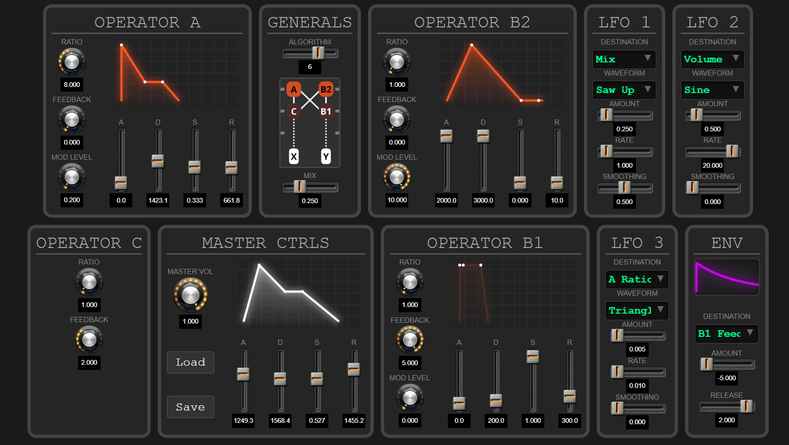
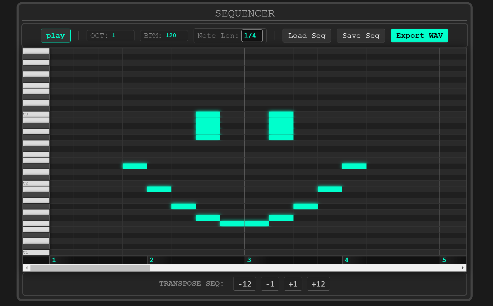

# Overview

This project is a 6-voice polyphonic FM synthesizer designed for the web.
Heavily inspired by the Elektron Digitone hardware synthesizer, it utilizes a client-server architecture for sound generation and playback.




**Key Features:**
* **Browser-based interaction:** Tweak parameters manually or load presets directly from the database.
* **Sequencer:** Compose melodies and chords using the built-in sequencer.
* **Audio Export:** Record your sessions and export the final result as a `.wav` file.
* **Deep Synthesis Engine:** 4 Operators per voice, 8 FM Algorithms, and comprehensive modulation matrices.

# Getting Started
### Prerequisites
* **Python:** Version 3.9.13 or later is required.
* **JavaScript:** Ensure your browser supports modern JavaScript (ES6 Modules).

### Installation

1. **Install Dependencies:**
   Install the required Python libraries by running the following command in your terminal:

   ``bash
   pip install firebase-admin numpy flask
   ``

2. **Database Configuration:**
    This project uses Google Firebase (Firestore) to save your synth presets and sequences. Since this is a web application, you need your own "backend" in the cloud. Follow these steps carefully:
        
    **A. Create a Firebase Project**
    1. Go to the [Firebase Console](https://console.firebase.google.com/) and log in with your Google account.
    2. Click **"Add project"** (or "Create a project").
    3. Give it a name (e.g., "My-Web-Synth") and toggle off Google Analytics (not needed for this). Click **"Create project"**.
    
    **B. Register the App**
    1. Once the project is ready, click **"add app"** and click on the Web icon (`</>`) on the dashboard to create a web app.
    2. Name it (e.g., "Synth-Client").
    3. Click "Register app".
    4. You will see a code block containing `const firebaseConfig = { ... };`. Keep this tab open or copy the content inside the curly braces `{...}`.
    > if you accidentally leave this window, you will still have access to this data: from the project page click the settings icon on the top-left corner, click "project settings" and scroll down

    **C. Configure the Code**
    1. In your project folder on your computer, locate `firebase_config.example.js` (check `static/firebase/` folders).
    2. Rename this file to `firebase_config.js`.
    3. Open it with a text editor (VS Code, Notepad, etc.).
    4. Replace the placeholder values with the real keys you copied in Step B. It should look like this:
    ```code
    export const firebaseConfig = {
        apiKey: "AIzaSyD...",
        authDomain: "your-project.firebaseapp.com",
        projectId: "your-project",
        storageBucket: "your-project.appspot.com",
        messagingSenderId: "123456...",
        appId: "1:123456..."
    };
    // Ensure you keep the export statement
    ```

    **D. Enable the Database (Crucial!)**
    1. Go back to the Firebase Console.
    2. On the left sidebar, expand **Build** and select **Firestore Database**.
    3. Click **"Create database"** and select **"standard version"**.
    4. Choose a location (e.g., eur3 (europe-west) or nam5 (us-central)).
    5. Security Rules: Select **"Start in Test Mode"**.
    > Note: Test mode allows read/write access for 30 days. This is perfect for development. For production, you would configure specific rules.
    6. Click **"Create"**.
    7. Done! Your database is now ready to accept presets.

3. **Run the Server:**
   Execute the server script:

   ```bash
   python server.py
   ```

4. **Launch:**
   * Wait for the message **"Synthesizer initialized correctly"** to appear in the terminal.
   * Open the provided localhost link (usually http://127.0.0.1:5000) in your web browser.

### Usage
* **Play Sound**: Press the **Spacebar** to trigger a note immediately.
* **Presets**: You can tweak parameters manually or load existing presets via the **"Load"** button in the "MASTER-CTRLS" section.
* **Sequencer**: Scroll down to access the sequencer interface. You can load saved sequences using the specific **"Load"** button found in this section.
* **Enjoy**: This is the most important step for using a synthesizer!

# Built with:
* Frontend: HTML5, CSS3, JavaScript (Vanilla)
* Backend: Python 3.9, Flask
* Database: Google Firebase (Firestore)
* Audio Processing: Python Vanilla + numpy on final audio buffer


# Sound Engine Specifics

* **Polyphony:** 6-voice polyphonic engine.
* **Algorithms:** 8 selectable FM algorithms to restructure operator routing.
* **Operators:** 4-Operator configuration per voice.
* **Modulation Envelopes:** Dedicated ADSR envelopes to shape the FM Index (timbre) over time.
* **Mix:** Crossfade slider to blend between the two sound generation layers (X/Y).
* **Amp Envelope:** Standard ADSR to control the output volume (amplitude).
* **LFOs:** 3 assignable LFOs per voice, capable of modulating most synthesis parameters.
* **Exponential Envelope:** An additional auxiliary envelope for complex modulation curves.

# UI & UX Guide

### Visual Feedback: Understanding the Algorithm
The dynamic diagram located in the **"GENERALS"** section is the most critical visual aid in the interface. It updates in real-time to show the current FM Algorithm (operator routing).

To improve clarity, the **ADSR envelopes** of the operators change color based on their current role in the selected algorithm:

* **<span style="color:red">Bright Red (Modulator):</span>** The operator is a clean modulator. Its envelope directly shapes the timbre (FM Index) of another operator.
* **<span style="color:orange">Bright Orange (Chained Modulator):</span>** The operator is modulating another modulator and it's modulated itself. variation in this operator parameters are very audible.
* **<span style="color:darkred">Dark Red (Carrier):</span>** The operator is outputting sound directly to the mix.
    * *Note:* Since Carriers output audio rather than modulating frequency, their "FM Intensity" envelope is visually dimmed to indicate it has **no effect** on the sound timbre in this specific configuration.

> **Important Note on Envelopes:** The Operator ADSR envelopes generate values relative to the **"MOD LEVEL"** knob. If `MOD LEVEL` is set to `0`, the envelope will remain flat, and no modulation will be audible regardless of the ADSR shape.

### Controls & Shortcuts

**Global**
| Action | Function |
| :--- | :--- |
| **Spacebar** | Toggle Play / Pause |


**Synthesizer Knobs**
| Interaction | Function |
| :--- | :--- |
| **Mouse Wheel** | Adjust value (Coarse) |
| **Shift + Wheel / Drag** | Fine-tune value (Precision mode) |
| **Ctrl + Click** | Reset to default value |
| **Text Input** | Type exact value in the box below the knob |


**Sequencer Grid**
| Interaction | Function |
| :--- | :--- |
| **Mouse Wheel** | Vertical Scroll (Navigate Octaves) |
| **Shift + Mouse Wheel** | Horizontal Scroll (Navigate Steps) |


# How it's structured: Directory Tree

```text
├── server.py           # Application entry point (Flask)
├── synth/              # Python Audio Engine modules
├── routes/             # API & Routing logic
├── static/             # Frontend assets (JS, CSS, Images, HTML)
├── README.md           # Main project overview
└── DOCUMENTATION.md    # Detailed documentation
```